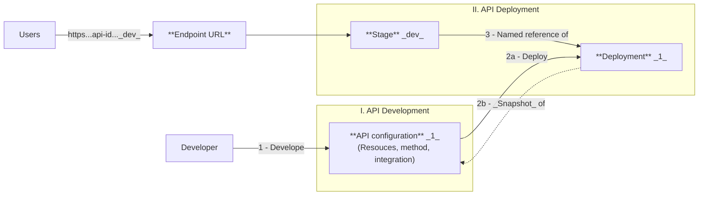
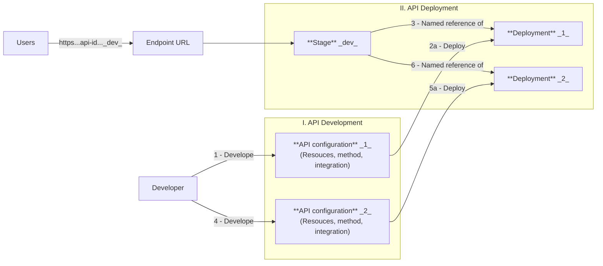

# API Gateway - Deployment and stage (WIP)

```mermaid
graph LR
  Dev["Developer"]
  C["**Deployment** _1_"]
  %% C2["**Deployment** _2_"]
  E[**Endpoint URL**]
  U[Users]
  S["**Stage** _dev_"]

  subgraph I. API Development
    A["**API configuration** _1_<br>(Resouces, method, integration)"]
    %% A2["**API configuration** _2_<br>(Resouces, method, integration)"]
  end

  subgraph II. API Deployment
    S -->|3 - Named reference of| C
    C -.->|2b - _Snapshot_ of| A
    %% C2 -.->|5a - _Snapshot_ of| A
    %% S -->|6 - Named reference of| C2

    %% A2 -->|5b - Deploy| C2
    A -->|2a - Deploy| C
  end

  U -->|"https...api-id..._dev"_| E
  E --> S

  Dev -->|1 - Develope| A
  %% Dev -->|4 - Update| A2
```

---

```mermaid
graph LR
  Dev["Developer"]
  C["**Deployment** _1_"]
  C2["**Deployment** _2_"]
  E[Endpoint URL]
  U[Users]
  S["**Stage** _dev_"]

  subgraph I. API Development
    A["**API configuration** _1_<br>(Resouces, method, integration)"]
    A2["**API configuration** _2_<br>(Resouces, method, integration)"]
  end

  subgraph II. API Deployment
    S -->|3 - Named reference of| C
    %% C -.->|2b - _Snapshot_ of| A
    %% C2 -.->|5b - _Snapshot_ of| A2
    S -->|6 - Named reference of| C2

    A2 -->|5a - Deploy| C2
    A -->|2a - Deploy| C
  end


  U -->|"https...api-id..._dev"_| E
  E --> S

  Dev -->|1 - Develope| A
  Dev -->|4 - Develope| A2
```
